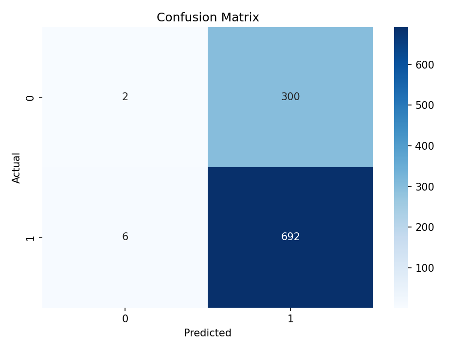
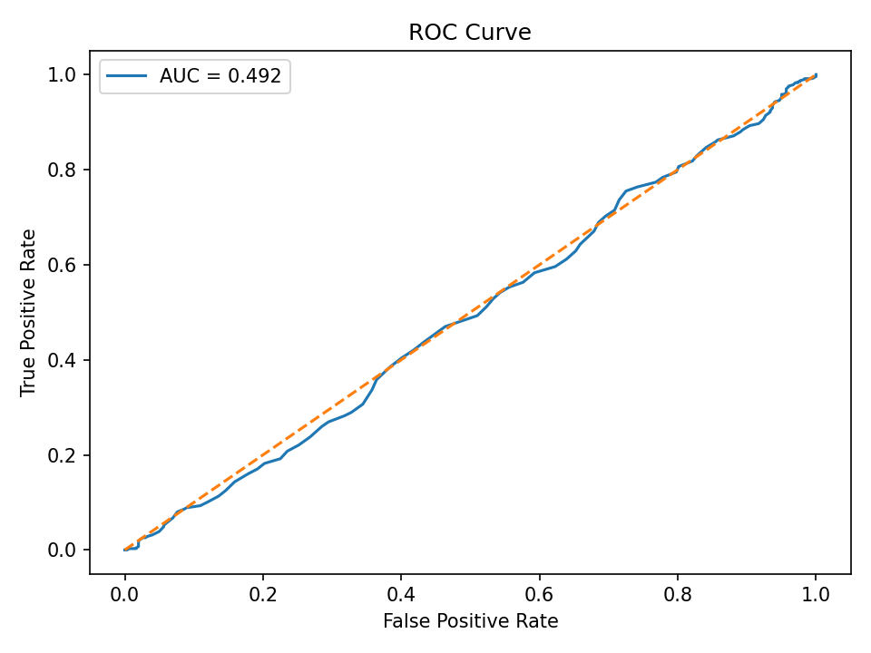
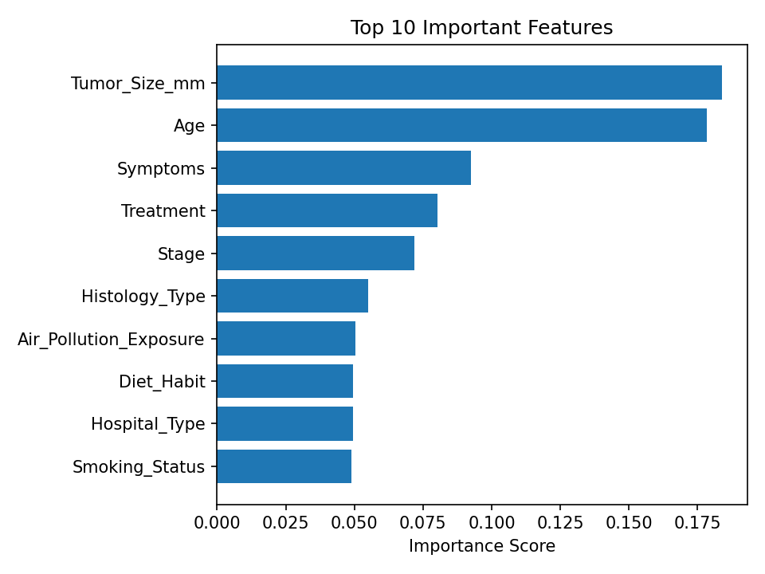
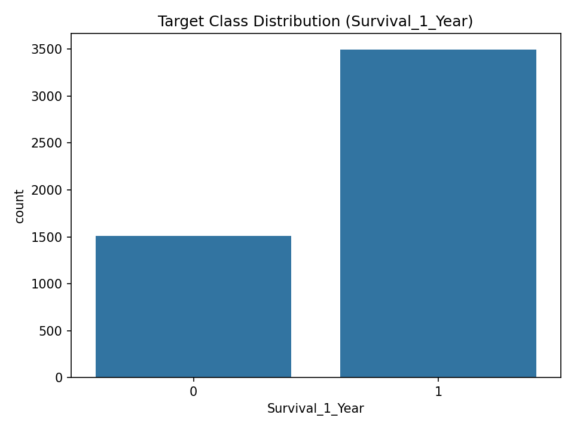
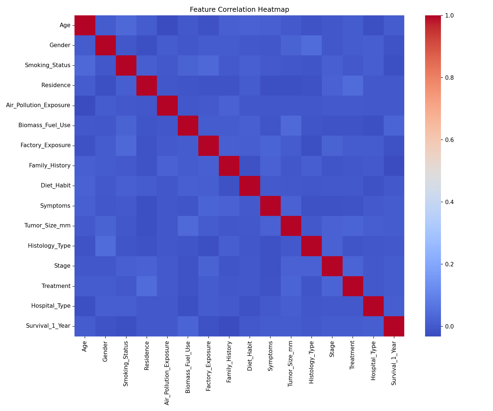

# OncoFusionNet-LC

**Artificial Intelligence in Cancer Therapy: An Enhanced Machine Learning Framework for Personalized Lung Cancer Treatment Prediction**

IEEE conference paper (Paper ID 492) submitted to **NMITCON-2026**.

Author: **Vishwajeet Singh**, School of CS & IT (MCA), Jain (Deemed-to-be University), JGI Knowledge Campus, Bengaluru, India — with Sindhu R Kashyap, Syed Faizan Pasha, and Suvendu Mata.

---

## Overview

This repository contains the code, dataset, and paper for **OncoFusionNet-LC**, a soft-voting ensemble framework (Logistic Regression + Random Forest + SVM) proposed for one-year survival prediction in lung cancer patients, benchmarked on the **Synthetic Lung Cancer Dataset (Bangladesh Perspective)** — 5,000 records, 15 demographic/clinical/environmental predictor features.

## Key finding

The revised, submitted version of this paper reports an important **negative result**: after a leakage-free 80:20 stratified split and a dedicated dataset-reliability audit (mutual information, majority-class baseline, 5-fold cross-validated AUC across multiple algorithm families), **none of the benchmarked models — including OncoFusionNet-LC — learned a discriminative signal beyond the dataset's class imbalance**:

| Model | Accuracy | AUC |
|---|---|---|
| Logistic Regression | 69.2% | 0.510 |
| Decision Tree | 48.0% | 0.476 |
| Random Forest | 54.0% | 0.470 |
| SVM (RBF) | 69.1% | 0.474 |
| **OncoFusionNet-LC (fusion)** | **65.2%** | **0.474** |
| *Majority-class dummy baseline* | *69.8%* | *0.50* |

A feature-blind majority-class classifier outperforms every trained model on raw accuracy, and AUC clusters tightly around 0.47–0.51 (chance level) across every algorithm family tested, including non-linear models built to capture feature interactions. The full audit and discussion are in the paper (`paper/OncoFusionNet-LC_Revised_Paper.pdf`).

Rather than reporting inflated performance, the paper treats this absence of signal as the primary, reportable finding, and argues that **dataset validity should be audited before, not after, model benchmarking** — particularly for synthetic healthcare data. The reusable contribution is the modular fusion architecture and audit protocol itself, intended for re-use on datasets with verified clinical provenance.

> An earlier project draft (before the reliability audit was added) reported an inflated accuracy of 69.2% and AUC of 0.73 for the fusion model. That version has been superseded — see [Project history](#project-history) below.

## Repository structure

```
OncoFusionNet-LC/
├── dataset/
│   └── lung_cancer.csv          # Synthetic Lung Cancer Dataset (Bangladesh Perspective), 5,000 records
├── src/
│   └── model_training.py        # Baseline Random Forest benchmark: preprocessing, training, evaluation, figures
├── results/
│   ├── classification_report.txt
│   ├── confusion_matrix.png
│   ├── correlation_heatmap.png
│   ├── feature_importance.png
│   ├── roc_curve.png
│   └── target_distribution.png
├── paper/
│   └── OncoFusionNet-LC_Revised_Paper.pdf   # Full submitted paper (IEEE format)
├── requirements.txt
├── LICENSE
└── README.md
```

## Dataset

**Synthetic Lung Cancer Dataset (Bangladesh Perspective)** — 5,000 patient records with 15 predictor features (plus patient ID and the target):

- **Demographic:** Age, Gender, Residence
- **Environmental:** Air Pollution Exposure, Biomass Fuel Use, Factory Exposure
- **Oncology:** Tumor Size, Histology Type, Stage
- **Other:** Smoking Status, Family History, Diet Habit, Symptoms, Treatment, Hospital Type
- **Target:** `Survival_1_Year` (Yes / No) — 69.8% Yes / 30.2% No

## Method

1. Drop `Patient_ID`; handle missing values (none present).
2. Label-encode categorical columns.
3. Stratified 80:20 train/test split.
4. Train a Random Forest classifier (`n_estimators=300`, `class_weight="balanced"`).
5. Evaluate with accuracy, classification report, confusion matrix, ROC-AUC.
6. Visualize target distribution, feature correlation, and feature importance.

The script in `src/model_training.py` is the baseline single-model benchmark actually run for this repository. The full paper additionally describes the three-model soft-voting fusion architecture (Logistic Regression + Random Forest + SVM, 1:2:1 weighting), SMOTE class balancing on the training partition only, and the dataset-reliability audit (mutual information, majority-class baseline, cross-validated AUC) — see the paper for the complete methodology and all reported model variants.

## Results

Running `src/model_training.py` on this dataset reproduces the same pattern reported in the paper — a Random Forest with strong-looking accuracy but an AUC close to 0.50 (random), and a confusion matrix dominated by the majority class:







## Setup

```bash
git clone https://github.com/<your-username>/OncoFusionNet-LC.git
cd OncoFusionNet-LC
python -m venv venv
source venv/bin/activate   # venv\Scripts\activate on Windows
pip install -r requirements.txt
```

## Running

```bash
python src/model_training.py
```

This reads `dataset/lung_cancer.csv`, trains the model, prints accuracy/classification metrics to the console, writes `results/classification_report.txt`, and regenerates all figures in `results/`.

## Limitations

- The dataset is synthetic; the reliability audit indicates it does not encode a learnable feature–outcome relationship for one-year survival, so results should not be extrapolated to real patient populations.
- The study covers lung cancer only.
- SHAP-based explainability and the clinician feedback dashboard described in the paper are proposed future work, not implemented here.
- Fairness/bias evaluation and real-time deployment requirements have not been assessed.

## Future work

- Validate the same pipeline on retrospective clinical cohorts with verified outcomes.
- Integrate CNN-based analysis of CT/PET imaging alongside structured features.
- Extend the benchmarking and audit methodology to other cancer types.
- Apply federated learning across institutions.
- Implement and evaluate SHAP-based explainability and a clinician feedback loop.
- Formalize the dataset-reliability audit into a reusable pre-registration checklist for synthetic healthcare datasets.

## Project history

This project went through a revision cycle for NMITCON-2026 (Paper ID 492):

1. **Initial draft** — reported a fusion-model accuracy of 69.2% and AUC of 0.73, without a dataset-reliability audit.
2. **Revised, submitted version** (included here) — added the leakage-free split, SMOTE-on-train-only correction, and the dataset-reliability audit, which revealed the dataset carries no learnable signal for this target. This is the version reflected in this README and in `paper/OncoFusionNet-LC_Revised_Paper.pdf`.

## Citation

```
Singh, V., Kashyap, S. R., Pasha, S. F., & Mata, S.
"Artificial Intelligence in Cancer Therapy: An Enhanced Machine Learning
Framework for Personalized Lung Cancer Treatment Prediction."
NMITCON-2026, Paper ID 492.
```

## Disclaimer

This is a research prototype and must not be used as a substitute for professional medical diagnosis or treatment.

## License

See [LICENSE](LICENSE). Please acknowledge the original research work if you reuse or build on this project.
